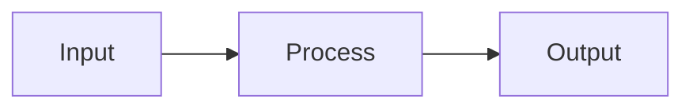

# @affanhamid/markdown-renderer

> A React markdown renderer built for AI-generated content. One import. Math, code, diagrams, callouts — all handled.

## The Problem

If you've used `react-markdown` with `remark-math` and `rehype-katex` to render LLM output, you've hit these problems:

| Problem | Details |
|---------|---------|
| **Dollar signs break everything** | `remark-math` uses `$` for math, but `$` is also currency. Their `singleDollarTextMath: false` disables single-dollar math entirely. This package disambiguates intelligently: `$20` → currency, `$x + y$` → math. |
| **Inconsistent math delimiters** | GPT, Claude, and Gemini variously output `$`, `$$`, `\(…\)`, and `\[…\]`. `remark-math` doesn't support `\(…\)` or `\[…\]`. This package normalizes all four formats automatically. |
| **Too many moving parts** | The standard setup: `react-markdown` + `remark-math` + `remark-gfm` + `rehype-katex` + KaTeX CSS + syntax highlighter + custom components. This package is **one import**. |

## Features

- **Math rendering** — KaTeX with automatic delimiter normalization (`$`, `$$`, `\(`, `\[`)
- **Dollar sign disambiguation** — currency vs. math, with CJK/Devanagari/fullwidth support
- **Syntax highlighting** — Shiki with `github-light` theme and copy-to-clipboard
- **Tables** — GFM-style with column alignment (left, center, right)
- **Executable code blocks** — optional `onRunCode` callback for running Python, R, etc.
- **Inline images** — `` works inside paragraphs, not just as standalone blocks
- **Semantic color tags** — `{color:important}text{/color}` for highlighting (important, definition, example, note, formula)
- **Callout blocks** — LaTeX-style `\begin{callout}{color}...\end{callout}` with any Tailwind color name
- **Mermaid diagrams** — fenced `mermaid` code blocks render as diagrams (client-side hydration with dynamic import)
- **Auto-scaling brackets** — `($x + y$)` automatically uses `\left(` and `\right)` for proper sizing
- **Prompt appendix** — exported `MATH_MARKDOWN_RULES_APPENDIX` string to append to your LLM system prompt, steering models toward consistent delimiter usage

## Installation

```bash
npm install @affanhamid/markdown-renderer
```

Peer dependency: `react >= 18`

## Usage

### React component

```tsx
import { MarkdownRenderer } from "@affanhamid/markdown-renderer";

function ChatMessage({ content }: { content: string }) {
  return <MarkdownRenderer markdown={content} />;
}
```

### With executable code blocks

```tsx
import { MarkdownRenderer } from "@affanhamid/markdown-renderer";

function Notebook({ content }: { content: string }) {
  const handleRunCode = async (code: string, language: string) => {
    const result = await executeOnServer(code, language);
    return {
      output: result.stdout,
      error: result.stderr,
      images: result.plots, // base64 data URIs
    };
  };

  return (
    <MarkdownRenderer
      markdown={content}
      onRunCode={handleRunCode}
      executableLanguages={["python", "r"]}
    />
  );
}
```

### Server-side HTML (no React)

```ts
import { renderMarkdownToHtml } from "@affanhamid/markdown-renderer";

const html = renderMarkdownToHtml(markdownString);
```

### Normalize delimiters only

If you want to preprocess markdown before passing it to your own renderer:

```ts
import { normalizeMathMarkdownDelimiters } from "@affanhamid/markdown-renderer";

// Converts \(...\) -> $...$, \[...\] -> $$...$$, inline $$...$$ -> $...$
const normalized = normalizeMathMarkdownDelimiters(rawMarkdown);
```

### Prompt engineering helper

Append this to your LLM system prompt to reduce delimiter inconsistency at the source:

```ts
import { MATH_MARKDOWN_RULES_APPENDIX } from "@affanhamid/markdown-renderer";

const systemPrompt = `You are a helpful assistant.\n\n${MATH_MARKDOWN_RULES_APPENDIX}`;
```

### Callout blocks

Use LaTeX-style syntax with any Tailwind color name:

```md
\begin{callout}{amber}
**Warning:** This operation is irreversible.
\end{callout}

\begin{callout}{green}
**Tip:** Use `Ctrl+S` to save quickly.
\end{callout}
```

Renders as styled callout boxes with `border-{color}-200`, `bg-{color}-50`, and `text-{color}-900` classes.

### Mermaid diagrams

Fenced code blocks with `mermaid` as the language render as diagrams:

````md

````

On the client, mermaid is dynamically imported and renders after hydration. For server-side rendering (`renderMarkdownToHtml`), a `<pre>` fallback is output inside a `.md-mermaid` container with `data-mermaid-code` for later hydration.

## API

### `<MarkdownRenderer />` (default export)

| Prop | Type | Default | Description |
|------|------|---------|-------------|
| `markdown` | `string` | required | Markdown content to render |
| `className` | `string` | `undefined` | CSS class applied to the wrapper `<div>` |
| `onRunCode` | `(code: string, language: string) => Promise<CodeExecutionResult>` | `undefined` | Callback for executing code blocks |
| `executableLanguages` | `string[]` | `["python", "r"]` | Languages that get a "Run" button |

### `CodeExecutionResult`

```ts
interface CodeExecutionResult {
  output: string;
  error?: string;
  images?: string[]; // data URIs or URLs
}
```

### `renderMarkdownToHtml(markdown: string, options?: { executableLanguages?: string[] }): string`

Renders markdown to an HTML string. Works without React (server-side, emails, PDFs).

### `normalizeMathMarkdownDelimiters(markdown: string): string`

Normalizes `\(...\)` to `$...$` and `\[...\]` to `$$...$$`. Converts inline `$$...$$` to `$...$`. Leaves code fences untouched.

### `MATH_MARKDOWN_RULES_APPENDIX: string`

A plain-text string with math formatting rules to append to LLM system prompts.

## Theming with Tailwind CSS

The `className` prop sets a class on the outer wrapper `<div>`, which you can use as a scoping selector for custom themes.

```tsx
<MarkdownRenderer markdown={content} className="my-theme" />
```

This renders:

```html
<div class="my-theme">
  <h1>...</h1>
  <p>...</p>
  <div class="md-callout ...">...</div>
  <!-- etc. -->
</div>
```

### Creating a theme file

Create a CSS file (e.g. `markdown-theme.css`) that uses descendant selectors scoped to your theme class. With Tailwind, use `@apply` for utility-based styling:

```css
/* markdown-theme.css */

.my-theme h1 {
  @apply text-3xl font-bold mt-8 mb-4 text-gray-900;
}

.my-theme h2 {
  @apply text-2xl font-semibold mt-6 mb-3 text-gray-800;
}

.my-theme p {
  @apply text-base leading-7 mb-4 text-gray-700;
}

.my-theme code {
  @apply bg-gray-100 text-sm px-1.5 py-0.5 rounded font-mono;
}

.my-theme pre {
  @apply rounded-lg my-4 overflow-x-auto;
}

.my-theme .md-callout {
  @apply border-l-4 border-blue-400 bg-blue-50 px-4 py-3 my-4 rounded-r-lg;
}

.my-theme table {
  @apply w-full border-collapse my-4 text-sm;
}

.my-theme th {
  @apply bg-gray-50 font-semibold text-left px-3 py-2 border border-gray-200;
}

.my-theme td {
  @apply px-3 py-2 border border-gray-200;
}
```

Import the theme file in your app and pass the matching class name:

```tsx
import "./markdown-theme.css";

<MarkdownRenderer markdown={content} className="my-theme" />
```

### Semantic CSS classes

The renderer outputs these classes that you can target in your theme:

| Class | Element |
|-------|---------|
| `md-callout` | Callout/admonition blocks (`> [!NOTE]`, etc.) |
| `md-code-block` | Executable code block wrapper |
| `md-code-block-header` | Header bar above executable code blocks |
| `md-code-output` | Code execution output area |
| `md-code-error` | Code execution error output |
| `md-mermaid` | Mermaid diagram container |
| `md-run-btn` | "Run" button on executable code blocks |

### Works with server-side rendering

`renderMarkdownToHtml()` produces the same HTML structure (wrapped in `<div class="prose max-w-none">`), so the same theme CSS applies to both client and server-rendered output. For server rendering, scope your selectors to the `prose` class or add a wrapper with your theme class:

```ts
const html = renderMarkdownToHtml(content);
const themed = `<div class="my-theme">${html}</div>`;
```

## License

MIT
